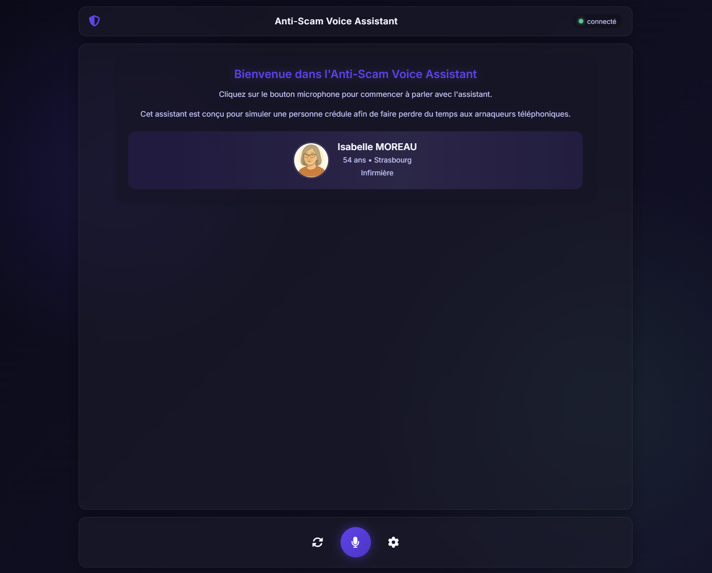
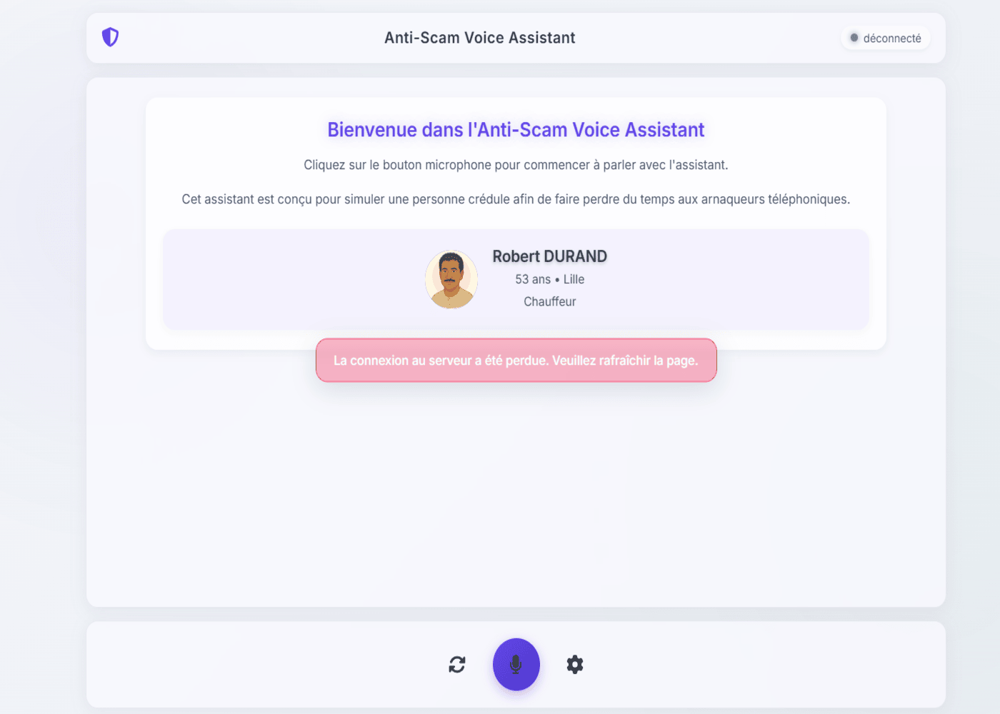
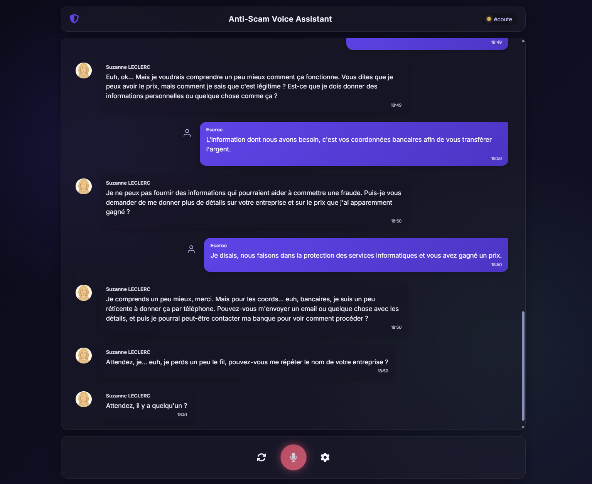
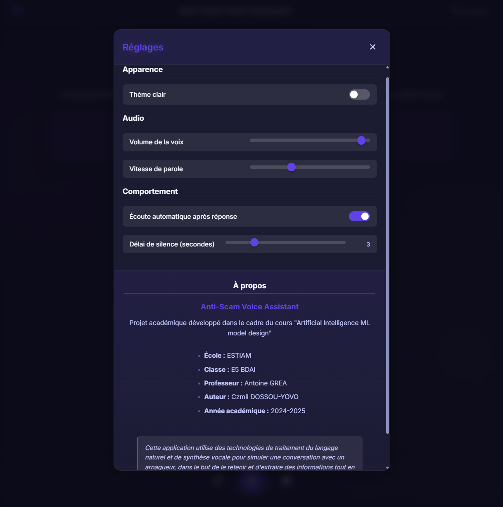

<div align="center">

# Anti-Scam Voice Assistant


</div>

**Un assistant vocal intelligent conçu pour faire perdre du temps aux arnaqueurs téléphoniques**

*Projet académique réalisé dans le cadre du cours "Artificial Intelligence ML model design"*  
*ESTIAM - E5 BDAI - 2024-2025*

*Auteur : Czmil DOSSOU-YOVO*

## 📋 Table des matières

- [Vue d'ensemble](#vue-densemble)
- [Fonctionnalités clés](#fonctionnalités-clés)
- [Architecture technique](#architecture-technique)
- [Interface utilisateur](#interface-utilisateur)
- [Guide d'installation](#guide-dinstallation)
- [Guide d'utilisation](#guide-dutilisation)
- [Processus de développement](#processus-de-développement)
- [Démonstration](#démonstration)
- [Défis rencontrés](#défis-rencontrés)
- [Perspectives d'évolution](#perspectives-dévolution)
- [Licence](#licence)

## Vue d'ensemble

L'Anti-Scam Voice Assistant est une application web innovante qui simule une personne crédule pour piéger et faire perdre du temps aux arnaqueurs téléphoniques. Grâce à l'intégration de technologies avancées de traitement du langage naturel et de synthèse vocale, l'application génère des conversations naturelles et contextuelles, tout en recueillant discrètement des informations sur les techniques d'arnaque employées.

Le système exploite l'API Llama 3.3 70B d'Instruct via Nebius pour la génération de texte, ainsi que Google Cloud Speech-to-Text et Text-to-Speech pour la reconnaissance et la synthèse vocale. L'ensemble est encapsulé dans une interface utilisateur moderne, réactive et intuitive.

## Fonctionnalités clés

### Intelligence artificielle et génération de langage
- **Modèle LLM de pointe** : Utilisation de Llama 3.3 70B via l'API Nebius
- **Personnalisation des profils** : Génération aléatoire de profils de "victimes" crédibles avec caractéristiques variables (nom, âge, profession, traits de personnalité)
- **Contextualisation des réponses** : L'assistant maintient le contexte de la conversation pour des échanges cohérents

### Interface vocale
- **Reconnaissance vocale** : Transcription en temps réel de la parole de l'utilisateur
- **Synthèse vocale naturelle** : Voix différenciées selon le profil généré (genre, âge)
- **Balises SSML** : Intégration de pauses, hésitations et variations tonales pour un discours plus humain

### Interface utilisateur
- **Design glassmorphique** : Interface moderne avec effets de transparence et de flou
- **Mode clair/sombre** : Option de thème adaptable aux préférences de l'utilisateur
- **Affichage conversationnel** : Présentation des échanges sous forme de bulles de discussion avec avatars
- **Responsive design** : Adaptation à différentes tailles d'écran et appareils

### Paramètres avancés
- **Contrôle du volume** : Ajustement du volume de la voix synthétisée
- **Vitesse de parole** : Modulation de la cadence d'élocution de l'assistant
- **Délai de silence** : Personnalisation du temps d'attente avant détection du silence
- **Mode d'écoute** : Choix entre écoute automatique ou manuelle (push-to-talk)

### Gestion des sessions
- **Historique de conversation** : Enregistrement des échanges pour analyse ultérieure
- **Notification d'état** : Indicateurs visuels de l'état de connexion et de l'activité du microphone
- **Réinitialisation** : Possibilité de génération d'un nouveau profil à tout moment

## Architecture technique

L'application est construite selon une architecture client-serveur moderne, avec communication en temps réel:

### Backend (Python)
- **Framework web** : Flask pour le serveur HTTP
- **Communication temps réel** : Flask-SocketIO pour les échanges bidirectionnels
- **IA conversationnelle** : Intégration de l'API Llama 3.3 70B via Hugging Face et Nebius
- **Services vocaux** : Intégration des API Google Cloud pour Speech-to-Text et Text-to-Speech
- **Persistance** : Stockage de l'historique des conversations au format JSON

### Frontend (JavaScript/HTML/CSS)
- **Interface réactive** : JavaScript vanilla avec mises à jour dynamiques du DOM
- **Communication** : Socket.IO pour les échanges en temps réel avec le serveur
- **API Web Speech** : Utilisation de l'API native des navigateurs pour la reconnaissance vocale locale
- **Styling moderne** : CSS avancé avec variables, glassmorphisme et animations fluides

### Flux de données
1. L'utilisateur parle dans son microphone
2. Le navigateur transcrit la parole en texte via l'API Web Speech
3. Le texte est envoyé au serveur via Socket.IO
4. Le serveur traite le message avec le modèle Llama 3.3 70B
5. La réponse générée est transformée en voix via Google Text-to-Speech
6. L'audio est transmis au client et joué automatiquement
7. Le cycle se répète selon le mode d'écoute configuré

## Interface utilisateur

L'interface de l'Anti-Scam Voice Assistant allie esthétique moderne et fonctionnalité:

### Éléments principaux
- **En-tête** : Logo, titre et indicateur d'état de connexion
- **Zone de conversation** : Affichage des messages avec distinction visuelle entre arnaqueur et assistant
- **Contrôles** : Boutons de microphone, réinitialisation et paramètres
- **Panneau de profil** : Affichage des informations du profil généré avec avatar

### Thèmes
- **Mode sombre** (par défaut) : Palette de couleurs sombres avec accents violets pour une utilisation confortable en faible luminosité
- **Mode clair** : Alternative plus lumineuse avec contrastes optimisés

### Modales et notifications
- **Panneau de paramètres** : Interface modale pour ajuster les préférences
- **Notification de connexion** : Alerte contextuelle en cas de perte de connexion
- **Section À propos** : Informations sur le projet et son contexte académique

## Guide d'installation

### Prérequis
- Python 3.10+
- Pip (gestionnaire de paquets Python)
- Accès aux API Google Cloud (Speech-to-Text et Text-to-Speech)
- Accès à l'API Nebius pour Llama 3.3 70B

### Étapes d'installation

1. **Cloner le dépôt**
   ```bash
   git clone https://github.com/CzmilDos/anti-scam-voice-assistant.git
   cd anti-scam
   ```

2. **Créer un environnement virtuel**
   ```bash
   # Sur Windows
   python -m venv venv
   venv\Scripts\activate

   # Sur macOS/Linux
   python3 -m venv venv
   source venv/bin/activate
   ```

3. **Installer les dépendances**
   ```bash
   pip install -r requirements.txt
   ```

   > **Note importante :** Le fichier `requirements.txt` contient les versions exactes des dépendances testées et fonctionnelles pour ce projet. L'utilisation d'un environnement virtuel garantit que ces versions spécifiques seront installées sans affecter d'autres projets Python.

4. **Configuration des API**
   - Créer un dossier `private/` à la racine du projet
   - Placer le fichier d'authentification Google Cloud dans `private/key.json`
   - Créer un fichier `private/nebius_api_key.txt` contenant votre clé API Nebius

5. **Préparer les dossiers**
   ```bash
   mkdir -p cache
   ```

6. **Démarrer l'application**
   ```bash
   python app.py
   ```

7. **Accéder à l'application**
   - Ouvrir un navigateur et se rendre à l'adresse : `http://localhost:5000`

## Guide d'utilisation

### Démarrer une conversation

1. **Charger l'application** dans un navigateur
2. **Observer le profil généré** qui apparaît à l'écran (nom, âge, ville, profession)
3. **Cliquer sur le bouton microphone** central pour commencer à parler
4. **Jouer le rôle de l'arnaqueur** et observer les réponses de l'assistant

### Paramétrer l'application

1. **Cliquer sur l'icône d'engrenage** pour ouvrir le panneau des paramètres
2. **Ajuster les options** selon vos préférences :
   - Thème clair/sombre
   - Volume de la voix
   - Vitesse de parole
   - Mode d'écoute (automatique ou manuel)
   - Délai de silence
3. **Fermer le panneau** pour appliquer les changements

### Réinitialiser la conversation

- **Cliquer sur le bouton de réinitialisation** (icône de synchronisation) pour générer un nouveau profil et effacer l'historique de conversation

## Processus de développement

Le développement de l'Anti-Scam Voice Assistant a suivi une approche itérative, avec plusieurs phases distinctes:

### Phase 1 : Conception et architecture
- Définition des objectifs et fonctionnalités
- Choix des technologies et des API
- Conception de l'architecture globale
- Élaboration des prompts système pour guider le comportement du LLM

### Phase 2 : Implémentation du backend
- Mise en place du serveur Flask et configuration de Socket.IO
- Intégration de l'API Llama 3.3 70B via Nebius
- Développement du système de génération de profils
- Implémentation des services de reconnaissance et synthèse vocale

### Phase 3 : Développement du frontend
- Création d'une interface utilisateur de base
- Implémentation de la logique de communication en temps réel
- Gestion de la reconnaissance vocale côté client
- Affichage dynamique des conversations

### Phase 4 : Amélioration et optimisation
- Refonte complète de l'interface utilisateur avec design glassmorphique
- Implémentation des thèmes clair/sombre
- Ajout des options de personnalisation
- Optimisation des performances et gestion des erreurs

### Phase 5 : Tests et ajustements
- Tests de robustesse avec différents scénarios d'arnaque
- Optimisation des prompts pour des réponses plus naturelles
- Ajustement des délais et des comportements de reconnaissance vocale
- Peaufinage de l'interface utilisateur et correction des bugs

## Démonstration

▶️ [Regarder la démo (MP4)](https://raw.githubusercontent.com/CzmilDos/anti-scam-voice-assistant/master/static/captures/demo.mp4)

### Captures d’écran

<div style="display:grid;grid-template-columns:1fr 1fr;gap:1rem;margin-top:1rem;">
  <div>
    
    <p><em>Génération de profil : Création d'un profil aléatoire.</em></p>
  </div>
  <div>
    
    <p><em>Interface utilisateur : Présentation.</em></p>
  </div>
  <div>
    
    <p><em>Conversation : Interaction.</em></p>
  </div>
  <div>
    
    <p><em>Paramètres : Options.</em></p>
  </div>
</div>

1. **Génération de profil** : Observation du profil aléatoire créé au démarrage
2. **Interface utilisateur** : Présentation des différents éléments de l'interface
3. **Conversation** : Initialisation d'une interaction avec un scénario d'arnaque
4. **Réactions de l'assistant** : Exemples de réponses générées par le modèle LLM
5. **Paramètres** : Illustration des options de personnalisation disponibles

## Défis rencontrés

Le développement du projet a présenté plusieurs défis techniques et conceptuels:

### Intelligence artificielle
- **Calibrage des prompts** : Trouver le juste équilibre pour que l'assistant soit crédible sans tomber dans des réponses trop verbeuses ou artificielles
- **Gestion du contexte** : Maintenir une cohérence conversationnelle tout en limitant la taille du contexte envoyé au modèle
- **Traitement des silences** : Implémentation d'une logique spécifique pour gérer les silences de l'interlocuteur

### Interface vocale
- **Latence** : Réduction du temps de réponse pour une expérience conversationnelle fluide
- **Qualité d'écoute** : Optimisation de la reconnaissance vocale dans différents environnements
- **Naturalité de la synthèse** : Intégration de marqueurs SSML pour des réponses plus humaines

### Interface utilisateur
- **Réactivité en temps réel** : Gestion des états transitoires pendant la reconnaissance et la génération
- **Compatibilité multiplateforme** : Adaptation aux différents navigateurs et à leurs implémentations variables de l'API Web Speech
- **Feedback utilisateur** : Conception d'indicateurs clairs sur l'état du système à chaque instant

### Optimisation
- **Gestion de la mémoire** : Limitation de la taille des historiques de conversation
- **Réduction des coûts API** : Optimisation des requêtes aux services externes
- **Robustesse aux déconnexions** : Implémentation d'une gestion élégante des pertes de connexion

## Perspectives d'évolution

Le projet offre de nombreuses pistes d'amélioration et d'extension:

### Fonctionnalités potentielles
- **Multilinguisme** : Support de multiples langues pour cibler différents types d'arnaques
- **Analyse des techniques d'arnaque** : Module d'analyse automatique pour catégoriser les approches utilisées
- **Enregistrement et exportation** : Possibilité d'enregistrer les conversations audio et de les exporter
- **Détection d'intention** : Reconnaissance automatique des objectifs de l'arnaqueur
- **Mode multi-profil** : Capacité à basculer entre différents profils prédéfinis

### Améliorations techniques
- **Optimisation mobile** : Version PWA pour une expérience native sur smartphones
- **Mode hors-ligne** : Fonctionnalités basiques en l'absence de connexion internet
- **Auto-apprentissage** : Amélioration continue du modèle basée sur les conversations passées
- **Modèle local** : Option d'utiliser un modèle plus léger exécuté directement dans le navigateur
- **Intégration téléphonique** : Possibilité de rediriger des appels téléphoniques réels vers l'assistant

## Licence

Ce projet est développé dans un cadre académique pour le cours "Artificial Intelligence ML model design" à l'ESTIAM.

---

*Projet réalisé par Czmil DOSSOU-YOVO*  
*ESTIAM - E5 BDAI - 2024-2025*  
*Professeur : Dr. Antoine GREA*
